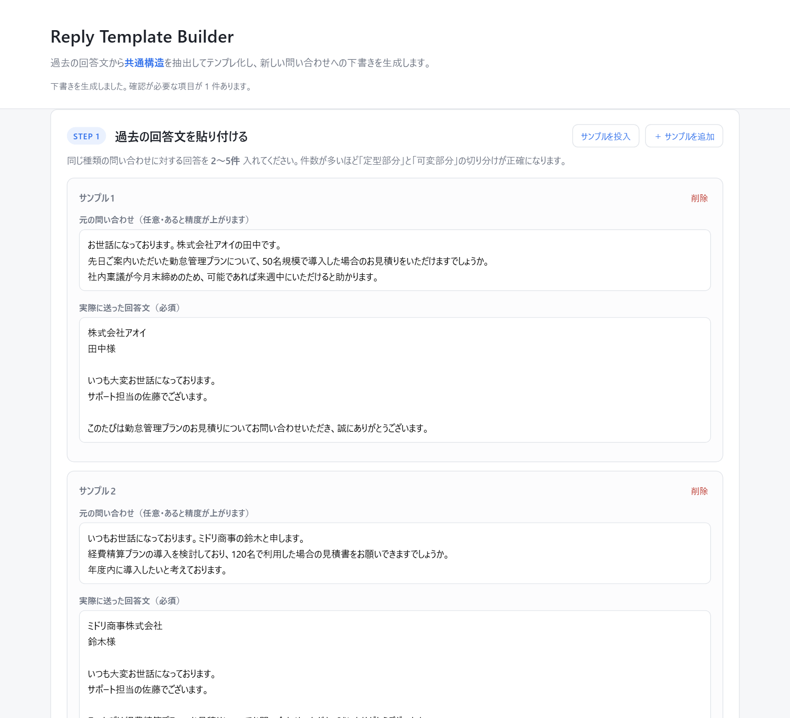
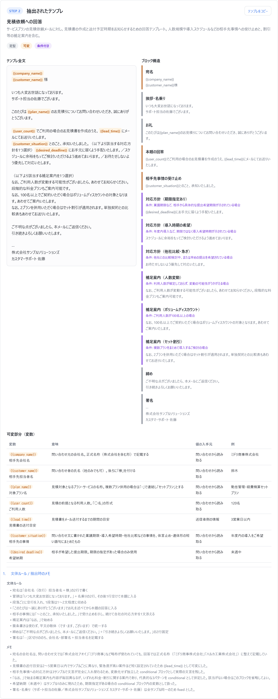
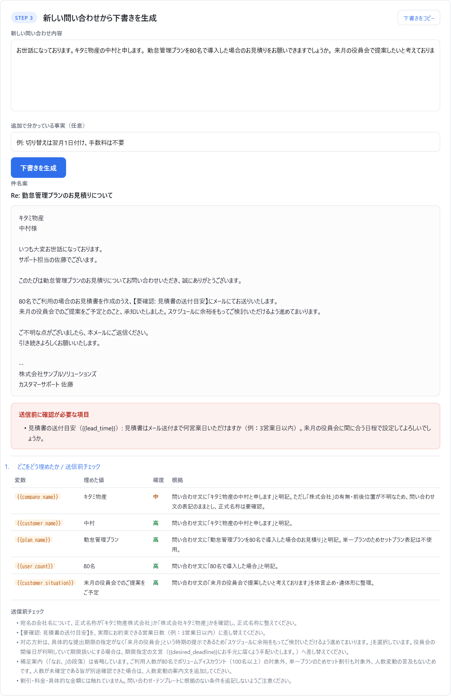

# Reply Template Builder

過去に送ったメール回答文を 2〜5 件貼り付けると、**複数サンプルの共通構造を抽出して再利用可能なテンプレート**に変換し、新しい問い合わせに対する回答下書きを生成する Web アプリです。

> 「似た内容だが微妙に異なる回答文を、毎回ゼロから書いている」という問題を、テンプレの手作業メンテなしで解決することを狙っています。

依存は `express` / `@anthropic-ai/sdk` / `zod` の 3 つだけ。ビルドステップなしで `npm install && npm start` で動きます。

---

## 画面

### STEP 1 — 過去の回答文を貼り付ける

同じ種類の問い合わせに対する回答を 2〜5 件入力します。



### STEP 2 — 抽出されたテンプレ

定型 / 可変 / 条件付きの 3 種に分類され、可変部分は `{{key}}` として本文中でハイライトされます。右側のブロック構造で、どの段落がどの分類なのかを確認できます。



### STEP 3 — 新しい問い合わせから下書きを生成

埋めた変数は「値 + 確度 + 根拠」付きで表示され、埋められなかった項目は本文に `【要確認: ○○】` として残ります。



---

## 何が面白いのか（技術的な見どころ）

単純な文字列 diff や穴埋めテンプレではなく、**複数サンプルを構造的に突き合わせて共通構造を復元する**ところがこのアプリの中核です。

`src/prompts.js` で、モデルに次の手順を明示的に踏ませています。

1. **分割** — 各サンプルを役割ごとのブロック（宛名 / お礼 / 本題の回答 / 補足 / 締め / 署名 …）に分解する
2. **対応付け** — サンプル間で同じ役割のブロックを、順番が違っても役割ベースで対応させる
3. **分類** — 対応付けたブロックを 3 種に判定する
   - `fixed` … 全サンプルでほぼ一致する定型文
   - `variable` … 役割も文型も共通で、差し替わるのが語句だけ → `{{key}}` に置換
   - `conditional` … 一部のサンプルにしか出てこない → 適用条件付きで実際の文言を保持
4. **変数の意味づけ** — 文字列の差分ではなく「何を表す情報か」で命名する
   （`3営業日` / `1週間程度` → `{{lead_time}}`、`見積書` / `仕様書` → `{{deliverable}}`）
5. **文体規約の抽出** — 敬語レベル、段落構成、クッション言葉の癖、署名の形式を `styleGuide` に切り出す

つまり「差分を機械的に穴に置き換える」のではなく、**差分の背後にある意味を推定して変数化する**のが AI を使う理由になっています。

### 出力を JSON に固定する

抽出結果・生成結果はどちらも **Structured Outputs**（`output_config.format`）で受け取っています。Zod スキーマ（`src/schemas.js`）がそのまま「モデルに何を出させたいか」の定義になり、パース失敗のリトライやマークダウンの剥がし処理が不要になります。

---

## 開発過程：変数の粒度をどう作り込んだか

このアプリで一番手間がかかったのはコードではなく、**抽出の品質をプロンプトで作り込む部分**でした。素朴な指示では実用に耐えるテンプレになりません。

### 何が起きたか

初期のプロンプトは「役割は共通だが中身が毎回変わる部分を変数にする」という指示でした。文面としては妥当ですが、これだと**文をまるごと変数にしてしまいます**。

```
このたびは{{inquiry_topic}}について{{gratitude_or_apology}}

{{request_detail}}、{{action_taken}}。{{lead_time}}に対応いたします。
{{supplementary_note}}
```

文法的には正しいテンプレですが、`{{action_taken}}` や `{{supplementary_note}}` を埋めるには結局全文を書くことになり、テンプレとしての価値がありません。

### 3 世代の改善

| | 1 回目 | 2 回目 | 3 回目 |
| --- | --- | --- | --- |
| 変数の数 | 10 | 11 | **5** |
| 文まるごとの変数 | 6 個 | 4 個 | **0 個** |
| 地の文に残った述部 | ほぼ無し | ほぼ無し | **全ブロックに存在** |
| 条件分岐の扱い | `{{gratitude_or_apology}}` に潰れる | 同左 | **7 個の条件付きブロックに実文言付きで分離** |

3 回目以降は実行ごとに変数 5〜7 個で揺れますが、いずれも語句レベルに収まっています。

改善後の出力がこちらです。述部が地の文に残り、差し替わるのは語句だけになっています。

```
{{user_count}}でご利用の場合のお見積書を作成のうえ、{{lead_time}}にメールにてお送りいたします。
```

### 効いた対策（3 方向）

**1. プロンプト側** — 粒度の制約を明示

- 変数にできるのは**語句レベル**（固有名詞・日付・数量・成果物名、目安 20 文字以内）
- 「〜いたします」などの述部は変数に含めず、地の文（`fixed`）側に残す
- 文言そのものが入れ替わる二択（お礼 ↔ お詫び）は 1 変数にまとめず、独立した `conditional` ブロックとして**具体的な文言を残す**
- 共通の文言が見つからない箇所を、変数の穴で逃げない
- 出力前に「変数を除いた本文が日本語として読めるか」を自己チェックさせる

**2. 入力データ側** — サンプルの選び方が結果を決める

初期のデモデータは「見積依頼・請求書の宛名変更・ログイン不具合」という**別種の問い合わせ**を混ぜていました。この場合、共通するのは宛名と署名だけで、本題部分には共通文言が存在しません。モデルには穴を空ける以外の選択肢がなく、プロンプトをいくら直しても改善しない構造でした。

同種（導入プランの見積依頼への回答 3 通）に差し替えたことで、初めて本題部分の共通文型が抽出できるようになりました。**プロンプトの問題に見えて、実は入力設計の問題だった**ケースです。

**3. コード側** — 機械的に検証する（`src/claude.js` の `reconcileTemplate`）

スキーマが保証するのは各フィールドの型だけなので、「変数表にはあるがテンプレ本文に出てこない」といった不整合はそのまま通ります。実際に `{{lead_time}}` が変数一覧にあるのに本文には存在しない、という出力が発生しました。

そこで変数表と本文を突き合わせ、双方向のずれを検出しています。**検出しても黙って直さず、必ず「抽出時のメモ」に記録して画面に出します。** テンプレの信頼性に関わる情報を利用者から隠さないためです。

---

## ハルシネーション対策

このジャンルのツールで最大の実運用リスクは、**AI が納期や価格を勝手に作った下書きが、確認されないまま送信されること**です。注意書きではなく出力スキーマで防いでいます。

- 情報が足りず埋められなかった変数は `missing` として返させ、本文には `【要確認: ○○】` を残す
- 埋めた変数は `filled` に「値 + 確度（high/medium/low）+ 根拠」付きで返させる
- テンプレにも問い合わせにも根拠がない事実は書かないことをプロンプトの制約に置く

### 実例：この仕組みが実データで作動したケース

問い合わせ文には「キタミ物産の中村と申します」としか書かれていません。しかしテンプレ側の宛名は正式名称を要求します。前株（株式会社キタミ物産）か後株（キタミ物産株式会社）かは**原理的に判別できません**。

実行するたびに、モデルは次の 3 通りのいずれかで応答しました。

| 挙動 | 結果 |
| --- | --- |
| 確度「中」で `キタミ物産` と埋め、根拠に「『株式会社』の有無・前後位置が不明なため、問い合わせ文の表記のまま」と記載、送信前チェックにも確認項目を追加 | 上のスクリーンショットの状態 |
| `missing` に回し、「正式名称は『キタミ物産株式会社』でよろしいでしょうか（法人格の有無・前後の位置をご確認ください）」と質問 | 宛名が `【要確認】` になる |
| 過去サンプルの傾向から `キタミ物産株式会社` と補う | そのまま送信可能 |

出力は非決定的ですが、**3 通りとも安全側**（捏造ではなく、確認要求か根拠付きの補完）に倒れています。日本のビジネスメールで宛名の法人格を間違えるのは実害のあるミスなので、この保守性は妥当だと判断しました。

---

## 動作検証

STEP 1〜3 を通しで実行し、以下を実データで確認済みです（検証スクリプトは開発用のためリポジトリ外）。

| 確認項目 | 結果 |
| --- | --- |
| 正常に生成できる | OK |
| 既知情報（会社名・担当者名・プラン名・人数）を正しく埋める | OK |
| 問い合わせに無い情報が `missing` になる | OK |
| 本文に `【要確認】` が残る | OK |
| 値・確度・根拠が対応している | OK |
| 納期・価格を勝手に作らない | OK |
| 未置換の `{{変数}}` が残らない | OK |

非決定性を踏まえて 2 回実行し、差が出たのは上記「実例」の宛名の扱いのみでした。

---

## セットアップ

必要なもの: Node.js 20.6 以上、Anthropic API キー

```bash
git clone https://github.com/yahuhuhuhuu/reply-template-builder.git
cd reply-template-builder
npm install
cp .env.example .env   # .env に ANTHROPIC_API_KEY を記入
npm start
```

http://localhost:3000 を開きます。

API キーを入れたらすぐ試せるよう、**「サンプルを投入」ボタン**でデモ用データ（導入プランの見積依頼への回答 3 通）を読み込めます。

> **使い方のコツ:** サンプルは**同じ種類の問い合わせへの回答**で揃えてください。見積依頼・宛名変更・不具合報告のように別種の回答を混ぜると、共通するのは宛名と署名だけになり、本題がまるごと 1 つの変数になった価値の低いテンプレしか作れません。種類ごとにテンプレを作るのが正しい使い方です。

### 環境変数

| 変数 | 必須 | 既定値 | 説明 |
| --- | --- | --- | --- |
| `ANTHROPIC_API_KEY` | ○ | — | [Anthropic Console](https://console.anthropic.com/settings/keys) で発行 |
| `ANTHROPIC_MODEL` | | `claude-opus-5` | 使用モデル |
| `PORT` | | `3000` | 待ち受けポート |

`.env` は `.gitignore` 済みです。API キーはサーバ側だけで扱い、ブラウザには一切渡していません。

---

## 構成

```
src/
  server.js    Express サーバ / 入力バリデーション / エラーハンドリング
  claude.js    Anthropic SDK 呼び出し。型付き例外を HTTP ステータスに変換、抽出結果の整合性検証
  prompts.js   共通構造の抽出手順と生成ルール（このアプリの中核）
  schemas.js   Zod スキーマ = Structured Outputs の出力契約
  samples.js   デモ用サンプルデータ
public/
  index.html / style.css / app.js   ビルド不要の素の SPA
```

### API

| メソッド | パス | 内容 |
| --- | --- | --- |
| `GET` | `/api/health` | 起動確認・API キー設定状況・使用モデル |
| `GET` | `/api/demo` | デモ用サンプルデータ |
| `POST` | `/api/extract` | `{ samples: [{ inquiry?, reply }], hint? }` → テンプレ JSON |
| `POST` | `/api/generate` | `{ template, inquiry, note? }` → 下書き JSON |

サンプルは 2〜5 件、1 件あたり 8,000 文字までに制限しています（サーバ側で検証）。

---

## 設計上のトレードオフ

**モデルは Claude Opus 5、adaptive thinking を有効化。**
ブロックの対応付けは推論を要する作業で、思考なしだと「文字列が違う箇所を全部変数にする」浅い結果になりやすいためです。レスポンスは 30 秒前後かかりますが、テンプレ作成は毎回行う操作ではないため許容しました。

**テンプレをサーバに保存しない。**
業務メールを含むため、状態はブラウザのメモリ上のみに置いています。リロードで消えるのは不便ですが、MVP の段階で他人の業務メールをサーバに置く判断はしませんでした。

**フロントはビルドレス。**
`git clone && npm install && npm start` で動くことを優先しました。DOM は `textContent` 由来で組み立てており、貼り付けたメール本文が HTML として解釈されることはありません。

**非決定性を消すのではなく、安全側に倒す。**
温度を下げても LLM の出力は揺れます。出力を固定しようとするより、「揺れても危険な方向には倒れない」構造（`missing` と根拠の明示）を作る方針を取りました。

---

## 既知の制約

- テンプレ全文（`templateText`）は、条件付きブロックの中から代表的なものを混ぜ込んだ形になります。全文だけを見てもどの行が条件付きかは判別しにくく、画面右の「ブロック構造」との突き合わせが必要です。本文側に条件マーカーを入れる案はありますが、「そのままコピーして送れる」利点が減るトレードオフがあります
- テンプレの永続化・編集機能がありません
- 自動テストがありません（整合性検証ロジックのみ手動でテスト済み）

## 今後やりたいこと

- テンプレの保存・一覧・バージョン管理
- 抽出後のテンプレを画面上で直接編集する
- 生成結果へのフィードバックをテンプレに反映する（1 往復で学習させる）
- 複数テンプレから問い合わせ内容に応じて自動でテンプレを選ぶ

## ライセンス

MIT
